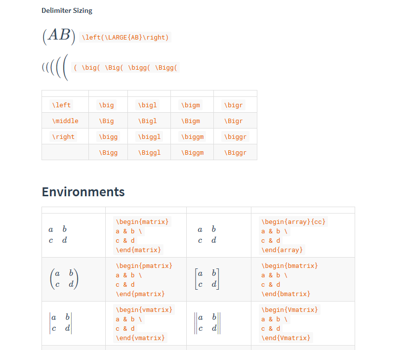

# docsify-katex

[](https://www.jsdelivr.com/package/npm/docsify-katex)
[](https://www.npmjs.com/package/docsify-katex)
[](https://www.npmjs.com/package/docsify-katex)

Add KaTeX support for your docsify project. [Demo](https://upupming.site/docsify-katex/docs)

[KaTeX](https://github.com/Khan/KaTeX) is a faster alternative to MathJax. This plugin makes it easy to support in your docsify project.



## Usage

Add `docsify-katex` CDN to your `index.html`:

```html
<!-- CDN files for docsify-katex -->
<script src="//cdn.jsdelivr.net/npm/docsify-katex@latest/dist/docsify-katex.js"></script>
<link rel="stylesheet" href="//cdn.jsdelivr.net/npm/katex@latest/dist/katex.min.css">
<!-- Put them above docsify.min.js -->
<script src="//cdn.jsdelivr.net/npm/docsify@latest/lib/docsify.min.js"></script>
```

## Build on your own

```bash
npm run build
```

## LaTeX Quick reference

+ [Supported functions](https://upupming.site/docsify-katex/docs/#/supported)
+ [Support table](https://upupming.site/docsify-katex/docs/#/support-table)
+ [Detexify](http://detexify.kirelabs.org/classify.html)
+ [MathJax quick reference on Stack Exchange](https://math.meta.stackexchange.com/questions/5020/mathjax-basic-tutorial-and-quick-reference)

## Inspired by

1. [vscode-markdown](https://github.com/neilsustc/vscode-markdown)
2. [neilsustc/markdown-it-katex](https://github.com/neilsustc/markdown-it-katex)

## Credits

1. [markdown-it](https://markdown-it.github.io/markdown-it/)
2. [KaTeX](https://github.com/Khan/KaTeX)